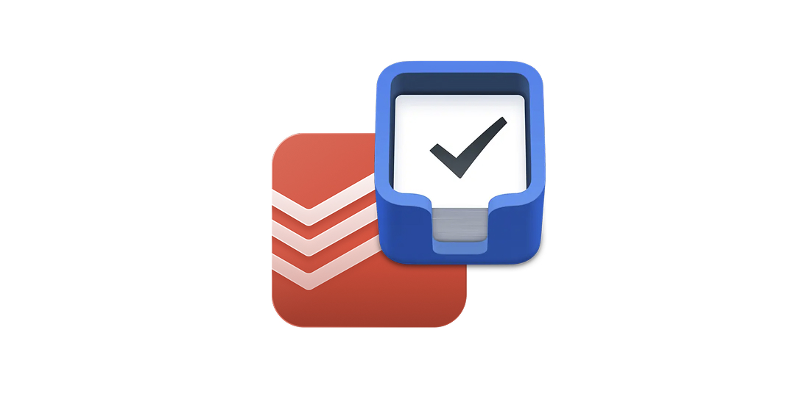

# Todoist ↔ Things Bidirectional Sync



A Cloudflare Worker that enables automatic bidirectional synchronization between Todoist and Things 3 inboxes. Perfect for users who want to use Things on Apple devices while maintaining access to their tasks on Android through Todoist.

## 🎯 Features

- **Bidirectional Sync**: Tasks created in either app automatically appear in the other
- **Duplicate Prevention**: Smart labeling system prevents sync loops
- **Automatic Sync**: Runs every 5 minutes via macOS LaunchAgent
- **Manual Sync**: Trigger sync on-demand when needed
- **Preserves Task Properties**: Due dates, notes, and tags are maintained
- **Non-destructive**: Tasks are labeled, not deleted after sync

## 🏗 Architecture

```
┌─────────────┐     ┌──────────────────┐     ┌─────────────┐
│   Todoist   │────▶│ Cloudflare Worker│◀────│  Things 3   │
│   (Inbox)   │     │   (API Bridge)   │     │  (Inbox)    │
└─────────────┘     └──────────────────┘     └─────────────┘
       ▲                                             │
       │                                             │
       └─────────────── macOS Scripts ◀──────────────┘
                    (LaunchAgent + AppleScript)
```

## 📋 Prerequisites

- macOS (for Things 3 and automation scripts)
- Things 3 for Mac (with URL scheme enabled)
- Todoist account with API access
- Cloudflare account (free tier works)
- Node.js 18+ and npm

## 🚀 Installation

### 1. Clone and Install

```bash
git clone https://github.com/yourusername/todoist-things-sync.git
cd todoist-things-sync
npm install
```

### 2. Get Todoist API Token

1. Log into [Todoist](https://todoist.com)
2. Go to Settings → Integrations → Developer
3. Copy your API token

### 3. Deploy to Cloudflare Workers

```bash
# Install Wrangler CLI globally (if not already installed)
npm install -g wrangler

# Login to Cloudflare
wrangler login

# Create KV namespace for sync metadata
wrangler kv:namespace create "SYNC_METADATA"
# Copy the ID from the output and update wrangler.toml with it

# Create the secret for your API token
wrangler secret put TODOIST_API_TOKEN
# Paste your Todoist API token when prompted

# Deploy the worker
npm run deploy
```

Save your worker URL (e.g., `https://todoist-things-sync.YOUR-SUBDOMAIN.workers.dev`)

### 4. Enable Things URL Scheme

1. Open Things 3 on Mac
2. Go to Things → Preferences → General
3. Enable "Enable Things URLs"

### 5. Setup macOS Automation

```bash
# Copy scripts to Library
cp scripts/sync-bidirectional.sh ~/Library/Scripts/
cp scripts/read-things-inbox.applescript ~/Library/Scripts/
cp scripts/tag-things-synced.applescript ~/Library/Scripts/
chmod +x ~/Library/Scripts/*.sh ~/Library/Scripts/*.applescript

# Configure and install LaunchAgent
export TODOIST_THINGS_WORKER_URL="https://YOUR-WORKER.workers.dev"
./scripts/setup-launchagent.sh
```

## 🔧 Configuration

### Environment Variables

Create a `.env` file for local development:

```bash
TODOIST_API_TOKEN=your_token_here
```

### Sync Interval

By default, sync runs every 5 minutes. To change this, edit the LaunchAgent plist:

```xml
<key>StartInterval</key>
<integer>300</integer><!-- seconds -->
```

### Sync Direction

You can use individual sync scripts if you only want one-way sync:

- **Todoist → Things only**: Use `sync-todoist-things-safe.sh`
- **Things → Todoist only**: Manually call the Things sync endpoint

## 📖 Usage

### Automatic Sync

Once configured, the LaunchAgent runs automatically every 5 minutes. Tasks are synced between both inboxes with these rules:

- New tasks in Todoist inbox → Copied to Things inbox
- New tasks in Things inbox → Copied to Todoist inbox
- Synced tasks are labeled to prevent re-syncing

### Manual Sync

```bash
# Run full bidirectional sync
~/Library/Scripts/sync-bidirectional.sh

# Check sync status
tail -f ~/Library/Logs/todoist-things-sync.log
```

### Managing Synced Tasks

- **Todoist**: Synced tasks have labels `synced-to-things` or `synced-from-things`
- **Things**: Synced tasks have tag `synced-from-todoist`

To clean up old synced tasks in Todoist:
1. Filter by label: `@synced-to-things`
2. Select all and archive/delete

## 🔌 API Endpoints

### GET /inbox
Fetch unsynced tasks from Todoist inbox

```bash
curl https://your-worker.workers.dev/inbox
```

### GET /inbox?format=url
Get Things-compatible import URL

```bash
curl https://your-worker.workers.dev/inbox?format=url
```

### POST /inbox/mark-synced
Mark tasks as synced (adds label)

```bash
curl -X POST https://your-worker.workers.dev/inbox/mark-synced
```

### POST /things/sync
Sync tasks from Things to Todoist

```bash
curl -X POST https://your-worker.workers.dev/things/sync \
  -H "Content-Type: application/json" \
  -d '[{"id":"123","title":"Task","notes":"","due":null,"tags":[]}]'
```

## 🐛 Troubleshooting

### Sync not running

```bash
# Check if LaunchAgent is loaded
launchctl list | grep todoist

# Reload if needed
launchctl unload ~/Library/LaunchAgents/com.todoist-things.bidirectional.plist
launchctl load ~/Library/LaunchAgents/com.todoist-things.bidirectional.plist
```

### AppleScript permissions

1. Go to System Preferences → Security & Privacy → Privacy → Accessibility
2. Add Terminal.app (or iTerm) to allowed apps
3. Restart the sync script

### Things not opening

- Ensure Things 3 is installed and has been opened at least once
- Test URL scheme: `open "things:///add?title=Test"`
- Check that "Enable Things URLs" is enabled in Things preferences

### View logs

```bash
# Sync logs
tail -f ~/Library/Logs/todoist-things-sync.log

# LaunchAgent errors
tail -f ~/Library/Logs/todoist-things-sync.stderr.log
```

## 🛠 Development

### Local Testing

```bash
# Copy .env.example and add your token
cp .env.example .env

# Run locally
npm run dev

# Test endpoints
curl http://localhost:8787/health
```

### Project Structure

```
├── src/
│   ├── index.ts        # Main worker entry point
│   ├── todoist.ts      # Todoist API client
│   ├── things.ts       # Things format converter
│   └── types.ts        # TypeScript types
├── scripts/
│   ├── sync-bidirectional.sh      # Main sync script
│   ├── read-things-inbox.applescript  # Read Things tasks
│   └── setup-launchagent.sh      # Install automation
└── wrangler.toml       # Cloudflare config
```

## 🤝 Contributing

Contributions are welcome! Please read [CONTRIBUTING.md](CONTRIBUTING.md) for guidelines.

### Development Setup

1. Fork the repository
2. Create a feature branch
3. Make your changes
4. Run tests (when available)
5. Submit a pull request

## 📄 License

This project is licensed under the MIT License - see the [LICENSE](LICENSE) file for details.

## 🙏 Acknowledgments

- Inspired by various Todoist-Things integration attempts
- Built with Cloudflare Workers for reliability
- Uses Things 3 URL scheme for integration

## ⚠️ Legal Disclaimer

**This is an unofficial, open-source project and is NOT affiliated with, endorsed by, or associated with:**
- **Cultured Code GmbH & Co. KG** (makers of Things 3)
- **Doist Inc.** (makers of Todoist)

**Important Legal Notice:**
- "Things" is a trademark of Cultured Code GmbH & Co. KG
- "Todoist" is a trademark of Doist Inc.
- This project is an independent tool created for personal use
- The developers of this project are not responsible for any data loss or issues
- Use at your own risk - always backup your data
- No warranty is provided, express or implied

**By using this software, you acknowledge that:**
- This tool may stop working if either service changes their API
- You are responsible for complying with both services' Terms of Service
- The project maintainers assume no liability for any issues arising from use

## ⚠️ Additional Disclaimers

- Tested on macOS Ventura/Sonoma with Things 3.18+
- Requires valid subscriptions/licenses for both services
- Not intended for commercial use

## 🔗 Links

- [Todoist API Documentation](https://developer.todoist.com/rest/v2/)
- [Things URL Scheme](https://culturedcode.com/things/support/articles/2803573/)
- [Cloudflare Workers](https://workers.cloudflare.com/)

---

Made with ❤️ for the productivity community